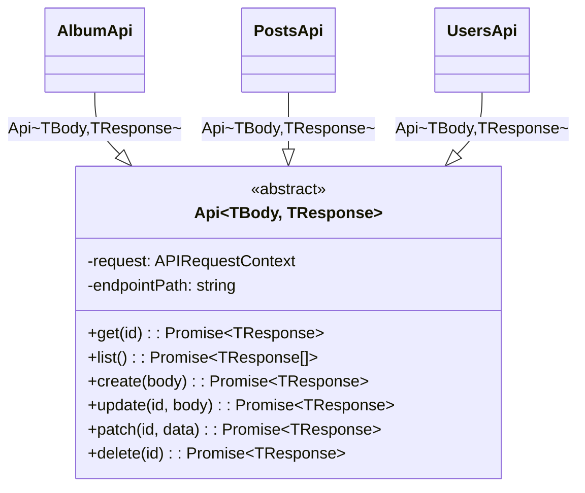

# Front-End Test Data Management – Generator Pattern Demo for Playwright

> **_⚠️Disclaimer:_**
This repository provides a conceptual and architectural demonstration of a Test Data Management (TDM) approach for frontend automation.  
It is not intended for production use, as it relies on the mock API at:
`https://jsonplaceholder.typicode.com.`


## 1. Overview ✨
Modern test automation ecosystems require reliable, deterministic, and fully isolated test data to ensure stability and repeatability.
This repository demonstrates a scalable Test Data Generator Framework designed for:
- 🔒 **environment cleanliness,**
- 🧪 **test isolation,**
- 📘 **test readability,**
- ⚙️ **automation maintainability,**
- 🚀 **enterprise scalability.**

## 2. Key Challenges Addressed ⚠️
### 2.1 Fragmented and inconsistent data preparation
Tests often contain inline data setup logic, leading to duplication and instability.
### 2.2 Polluted testing environments
❗ Stale objects accumulate and interfere with new runs.
### 2.3 Low readability and maintainability
📉 Test authors mix business flow with setup boilerplate.
### 2.4 Poor scalability
📦 Adding new data types requires rewriting setup logic across test suites.

## 3. Architectural Concept: Generator Pattern 🧩
### 3.1 Abstract Generator
Provides:
- 🔧 standard data creation
- 🗂️ internal tracking of created items
- ♻️ automated cleanup
- 🧱 a consistent interface for all domain generators

### 3.2 Domain-Specific Generators
Each business object (User, Post, Album…) has its own generator responsible for:
- 🧬 payload construction
- 🎲 randomized test data
- 🔗 optional API persistence
- 🧼 automatic cleanup management

### 3.3 API Abstraction Layer
Provides consistent CRUD operations:
- 📥 create
- 📤 update / patch
- 🔍 get / list
- 🗑️ delete

Every endpoint extends this abstraction, ensuring uniformity across the entire TDM stack.

#### Api Architecture diagram


### 3.4 Objectives of the Generator Architecture

The Generator subsystem is designed to achieve the following goals:

#### 🔧 1. Standardize test data creation

Each generator exposes the same set of high-level methods (generate, generateAndPost, cleanup, etc.), ensuring consistency across test suites and eliminating the need to manually construct payloads or API calls.
#### 🔄 2. Automate data lifecycle management

Generators track all entities they create and guarantee their cleanup after test execution, preventing data pollution, conflicts, and cascading failures.
#### 🧩 3. Separate test intent from test preparation

Test authors write tests that focus exclusively on the behavioral aspects of the system under test, while all data preparation logic resides inside generators.

#### 🚀 4. Enable backend-driven and UI-driven creation

Generators support:

- building payloads only (UI creation path),
- creating objects directly via backend API,
- hybrid scenarios.

#### 📈 5. Support easy extension

Adding a new domain entity to the automation framework requires only two things:

1. A new API client class
2. A new generator that extends the abstract base generator

No modifications to the core framework are needed.

#### 📦 Domain-Specific Generators

Examples:
- UsersGenerator
- PostsGenerator
- AlbumsGenerator

Responsibilities:
- define how to build a valid body for their domain,
- optionally create objects via the associated API,
- register externally created entities (e.g., created by the UI),
- expose minimal and predictable methods for use in tests.

Each generator holds its own API dependency, allowing it to persist or remove entities from the backend.

#### 🔗 Integration Between Generators

Some domain objects depend on others — for example:
- Posts and Albums require a valid User,
- therefore PostsGenerator and AlbumsGenerator depend on UsersGenerator.

This creates a clear and explicit dependency graph, which the framework encourages rather than hides, resulting in predictable and deterministic setup flows.

### Generator Architecture Diagram

```mermaid
classDiagram

class Generator~TBody, TResponse~ {
  <<abstract>>
  -createdItems: TResponse[]
  +generate(partial?): Promise~TBody~
  +generateAndPost(partial?): Promise~TResponse~
  +registerCreatedItemByName(name): Promise~void~
  +cleanup(): Promise~void~
}

class AlbumsGenerator {
  +generate(partial?): Promise
  +generateAndPost(partial?): Promise
  +registerCreatedItemByName(name): Promise
  +cleanup(): Promise
}

class PostsGenerator {
  +generate(partial?): Promise
  +generateAndPost(partial?): Promise
  +registerCreatedItemByName(name): Promise
  +cleanup(): Promise
}

class UsersGenerator {
  +generate(partial?): Promise
  +generateAndPost(partial?): Promise
  +registerCreatedItemByName(name): Promise
  +cleanup(): Promise
}

%% Dziedziczenie
AlbumsGenerator --|> Generator : Generator~TBody,TResponse~
PostsGenerator --|> Generator : Generator~TBody,TResponse~
UsersGenerator --|> Generator : Generator~TBody,TResponse~

%% PowiÄ…zania z API
AlbumsGenerator --> AlbumApi : uses
PostsGenerator --> PostsApi : uses
UsersGenerator --> UsersApi : uses

%% Zależność od UsersGenerator
AlbumsGenerator --> UsersGenerator : uses
PostsGenerator --> UsersGenerator : uses

```


## 4. Usage Scenarios 🎯
### 4.1 Backend-Driven Test Data Provisioning
- ⚡ Fast
- ✔️ Deterministic
- 🧹 Clean test body

### 4.2 UI-Driven Object Creation
Generators prepare payloads, UI creates it.
- 🖥️ Validates UI flows
- 🧩 Ensures payload consistency
- 🧼 Generator can still handle cleanup (after registering the object)

### 4.3 Hybrid Scenarios
Some attributes created via API, some via UI.
- 🔀 Flexible
- 🧱 Supports complex business processes

## 5. Cleanup & Lifecycle Management ♻️
- 🧾 All objects created via API are tracked.
- 🧹 Cleanup runs automatically (fixtures / teardown).
- 📝 Objects created in the UI can be registered manually.
- 🛡️ Prevents environment pollution and cross-test interference.

## 6. Integration with Test Frameworks 🧰
#### Recommended: Test Fixtures

Fixtures allow:
- 🧷 centralized configuration
- 🔄 predictable data lifecycle
- 🚀 pre-generating objects
- 🧼 automatic cleanup

#### Fixture example
```ts
export const test = base.extend<TestFixture>({
    usersApi: async ({ request }, use) => {
        const api = new UsersApi(request);
        await use(api);
    },

    usersGenerator: async ({ usersApi }, use) => {
        const generator = new UsersGenerator(usersApi);
        await use(generator);
        await generator.cleanup();
    },

    user: async ({ usersGenerator }, use) => {
        const user = await usersGenerator.generateAndPost();
        await use(user);
    },
})
```

#### Test example
```ts
test('user example test - on user created before test', async ({ user }) => {
    expect(user.name).toBeTruthy();
});
```

## 7. Enterprise Benefits 🏢
### 7.1 Improved Reliability
🛡️ Reduced flakiness and better pipeline stability.

### 7.2 Increased Developer Productivity
⚡ Authors focus on test logic, not setup complexity.

### 7.3 Reduced Maintenance Effort
🔧 One place to evolve data models across projects.

### 7.4 Scalability
📈 New object = new generator, zero framework changes.

### 7.5 Standardization
📚 Unified data-handling strategy across teams and test suites.

## 8. Extensibility 🔧

- ➕ Add new generators with minimal code.
- 🧱 Strong alignment with SOLID principles.
- 🔌 Ready for integration with real backend services.
- 🌐 Framework-agnostic and Playwright-friendly.

## 9. Conclusion ✅

This repository outlines a maintainable, scalable, and enterprise-ready approach to Test Data Management for frontend automation.
By isolating data concerns, enforcing lifecycle management, and unifying creation patterns, teams can build robust and future-proof Playwright test suites.
