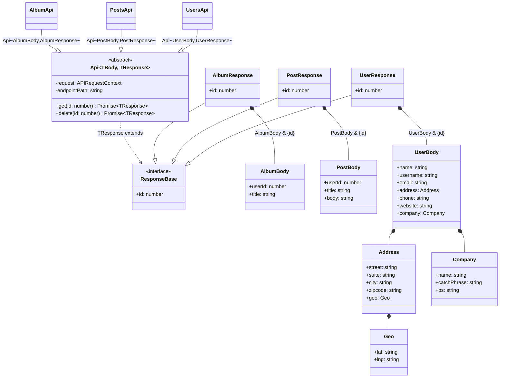

```mermaid
classDiagram
%% --- Core types / interfaces ---
class ResponseBase {
  <<interface>>
  +id: number
}

class Api~TBody, TResponse~ {
  <<abstract>>
  -request: APIRequestContext
  -endpointPath: string
  +get(id: number) Promise~TResponse~
  +delete(id: number) Promise~TResponse~
  %% inne metody pominięte w kodzie ("...")
}

Api ..> ResponseBase : TResponse extends

%% --- Album types ---
class AlbumBody {
  +userId: number
  +title: string
}

class AlbumResponse {
  +id: number
}

AlbumResponse --|> ResponseBase
AlbumResponse *-- AlbumBody : AlbumBody & {id}

%% --- Post types ---
class PostBody {
  +userId: number
  +title: string
  +body: string
}

class PostResponse {
  +id: number
}

PostResponse --|> ResponseBase
PostResponse *-- PostBody : PostBody & {id}

%% --- User types (zagnieżdżone obiekty rozbite na klasy pomocnicze) ---
class UserBody {
  +name: string
  +username: string
  +email: string
  +address: Address
  +phone: string
  +website: string
  +company: Company
}

class Address {
  +street: string
  +suite: string
  +city: string
  +zipcode: string
  +geo: Geo
}

class Geo {
  +lat: string
  +lng: string
}

class Company {
  +name: string
  +catchPhrase: string
  +bs: string
}

class UserResponse {
  +id: number
}

UserResponse --|> ResponseBase
UserResponse *-- UserBody : UserBody & {id}
UserBody *-- Address
Address *-- Geo
UserBody *-- Company

%% --- API classes ---
class AlbumApi
class PostsApi
class UsersApi

AlbumApi --|> Api : Api~AlbumBody,AlbumResponse~
PostsApi --|> Api : Api~PostBody,PostResponse~
UsersApi --|> Api : Api~UserBody,UserResponse~

```